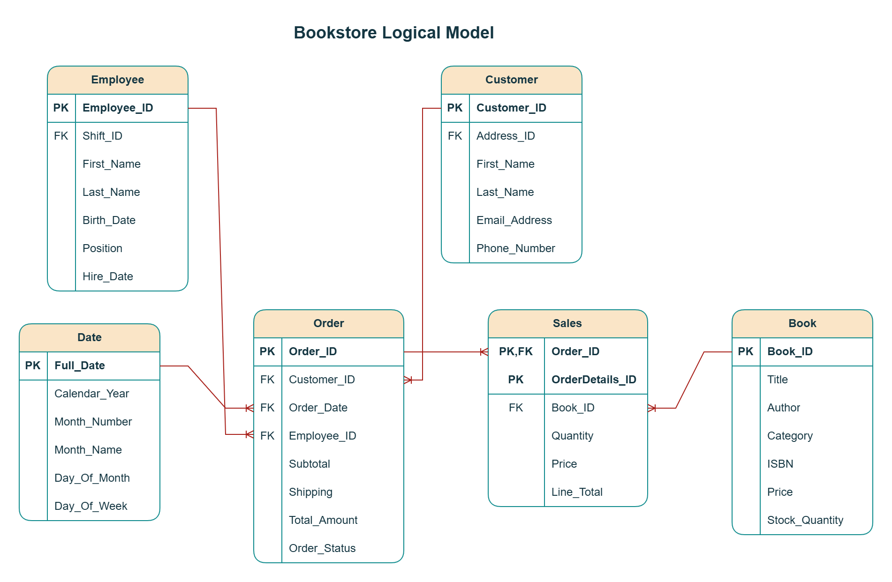
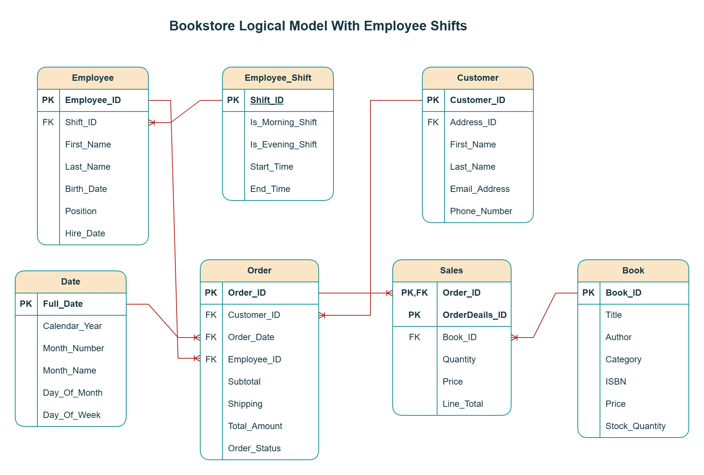

# Assignment 1: Design a Logical Model

## Question 1
Create a logical model for a small bookstore. 📚

At the minimum it should have employee, order, sales, customer, and book entities (tables). Determine sensible column and table design based on what you know about these concepts. Keep it simple, but work out sensible relationships to keep tables reasonably sized. Include a date table. There are several tools online you can use, I'd recommend [_Draw.io_](https://www.drawio.com/) or [_LucidChart_](https://www.lucidchart.com/pages/).

<br> I assume that this bookstore is an online bookstore. Relevant bookstore employees will arrange for the shipment of the books after they receive online orders from the customers. Below please find the logical model of this bookstore. 



__Notes:__ 
<br> 1. The primary key of Sales table is a composite key which is a combintation of Order_ID and OrderDetails_ID. Meanwhile, Sales.Order_ID is a foreign key referencing Order.Order_ID. 
<br> 2. Address_ID in the Customer table is the foreign key to Customer_Address table which is not shown in this logical model but explained in my answers to Question 3. 

## Question 2
We want to create employee shifts, splitting up the day into morning and evening. Add this to the ERD.

<br> I assume that this bookstore is an online bookstore. Relevant bookstore employees will arrange for the shipment of the books after they receive online orders from the customers. Below please find the bookstore's logical model with employee shifts. 



__Notes:__ 
<br> 1. In Employee_Shift table, the data type of Is_Morning_Shift and Is_Evening_Shift column is boolean; when either column is True, it will indicate it's a Morning or Evening Shift. 
<br> 2. The primary key of Sales table is a composite key which is a combintation of Order_ID and OrderDetails_ID. Meanwhile, Sales.Order_ID is a foreign key referencing Order.Order_ID. 
<br> 3. Address_ID in the Customer table is the foreign key to Customer_Address table which is not shown in this logical model but explained in my answers to Question 3. 


## Question 3
The store wants to keep customer addresses. Propose two architectures for the CUSTOMER_ADDRESS table, one that will retain changes, and another that will overwrite. Which is type 1, which is type 2?

_Hint, search type 1 vs type 2 slowly changing dimensions._

Bonus: Are there privacy implications to this, why or why not?
```
Your answer...
```
1. __Type 1 SCD (Overwriting Changes)__
<br> In a Type 1 SCD, we overwrite the old address with the new one. This does not keep a history of changes.

- __Customer_Address Table__
    - Address_ID: Primary Key
    - Customer_ID: Foreign key referencing Customer.Customer_ID
    - Street_Number: Street number
    - Street_Name: Street name
    - City: City
    - State_Province: State or Province
    - Postal_Code: Postal code
    - LastUpdated: Timestamp of the last update

2. __Type 2 SCD (Retaining Changes)__
<br> In a Type 2 SCD, we keep a history of all address changes. A new record is added for each address change.

- __Customer_Address Table__
    - Address_ID: Primary Key
    - Customer_ID: Foreign key referencing Customer.Customer_ID
    - Street_Number: Street number
    - Street_Name: Street name
    - City: City
    - State_Province: State or Province
    - Postal_Code: Postal code
    - Start_Date: Date when the address became effective
    - End_Date: Date when the address was no longer valid
    - IsCurrent: Boolean flag indicating if this is the current address

__Bonus: Privacy Implications__
<br> For Type 2 SCD, storing historical addresses raises privacy concerns, especially if customers move to sensitive locations. Data protection regulations like GDPR emphasize minimizing data storage to what's necessary and giving individuals control over their personal information. Retaining address history might require careful management of retention policies and privacy consent.

## Question 4
Review the AdventureWorks Schema [here](https://i.stack.imgur.com/LMu4W.gif)

Highlight at least two differences between it and your ERD. Would you change anything in yours?
```
Your answer...
```
<br> The major differences between AdventureWorks and my ERD are normalization and complexity. 

1. AdventureWorks schema is highly normalized and contains many more tables to handle specific aspects of the business in detail. For instance, there are separate tables for addresses, address types, business entities, products, and even subcategories and categories for products. In contrast, my bookstore ERD is much more simplified, consisting of only a few core tables. 

2. While my bookstore ERD has a simple __Customer_Address__ table, AdventureWorks uses a normalized schema for handling addresses. Its use of a junciton table (__BusinessEntityAddress__) and a type table (__AddressType__) avoids redundancy by storing each address only once in __Address Table__. It is more flexible because any entity can be linked to multiple addresses with different types (e.g., shipping and billing).

3. AdventureWorks uses the concept of Products and Categories, while my bookstore ERD has a simple Book table. AdventureWorks has a more generalized product model with categories, which is more flexible.

<br>  __Would I change anything?__
<br>  Based on the differences highlighted from the AdventureWorks schema, here are potential changes to my bookstore ERD.
<br> 1. If my bookstore grows or requires more detailed tracking (e.g., managing multiple suppliers or detailed inventory control), I might consider gradually normalizing my bookstore schema by adding more specialized tables like Vendor, Publisher, or Inventory. 
<br> 2. I would adopt a more normalized address schema (e.g., using junction table and address type table) if we expect to handle multiple addresses per customer or expand the types of addresses (e.g., home, shipping, business, primary office) to accommodate future growth or more delivery options.
<br> 3. If my bookstore expands into other items (e.g., stationery), I might want to adopt a more generalized "Product" table like AdventureWorks, rather than a specific "Book" table.

# Criteria

[Assignment Rubric](./assignment_rubric.md)

# Submission Information

🚨 **Please review our [Assignment Submission Guide](https://github.com/UofT-DSI/onboarding/blob/main/onboarding_documents/submissions.md)** 🚨 for detailed instructions on how to format, branch, and submit your work. Following these guidelines is crucial for your submissions to be evaluated correctly.

### Submission Parameters:
* Submission Due Date: `September 28, 2024`
* The branch name for your repo should be: `model-design`
* What to submit for this assignment:
    * This markdown (design_a_logical_model.md) should be populated.
    * Two Entity-Relationship Diagrams (preferably in a pdf, jpeg, png format).
* What the pull request link should look like for this assignment: `https://github.com/<your_github_username>/sql/pull/<pr_id>`
    * Open a private window in your browser. Copy and paste the link to your pull request into the address bar. Make sure you can see your pull request properly. This helps the technical facilitator and learning support staff review your submission easily.

Checklist:
- [ ] Create a branch called `model-design`.
- [ ] Ensure that the repository is public.
- [ ] Review [the PR description guidelines](https://github.com/UofT-DSI/onboarding/blob/main/onboarding_documents/submissions.md#guidelines-for-pull-request-descriptions) and adhere to them.
- [ ] Verify that the link is accessible in a private browser window.

If you encounter any difficulties or have questions, please don't hesitate to reach out to our team via our Slack at `#cohort-4-help`. Our Technical Facilitators and Learning Support staff are here to help you navigate any challenges.
